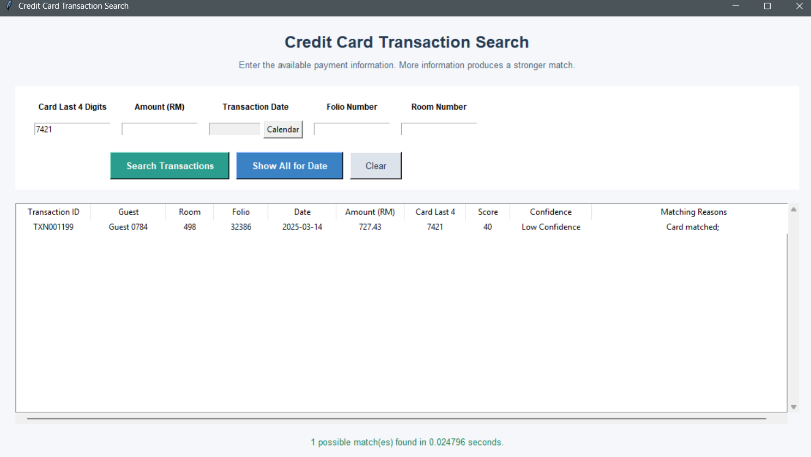
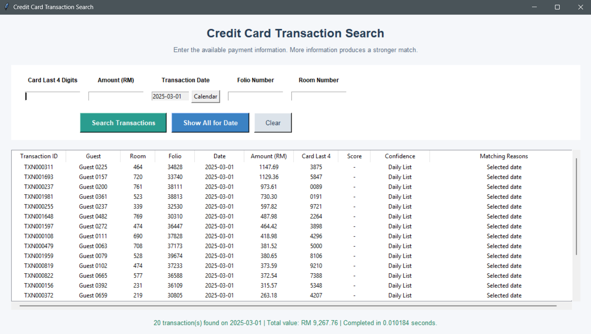

# Credit Card Transaction Allocation and Reconciliation Tool

A Python-based desktop application that helps finance staff locate and review credit-card transactions using partial payment information.

The project was inspired by a manual credit-card allocation process observed during a finance internship. It expands an initial search prototype into a documented data workflow containing data preparation, validation, weighted matching, functional testing, performance benchmarking, and a standalone graphical interface.

> **Privacy note:** This project uses completely synthetic data. No real hotel, guest, card, or financial information is included.

## Business Problem

Credit-card allocation may require staff to manually scroll through many folio records to locate the transaction corresponding to a payment. This becomes time-consuming when only limited information such as the last four card digits and amount is available.

This project supports that workflow by:

- Searching transactions using multiple available criteria
- Ranking possible matches with a weighted score
- Explaining why each candidate matched
- Separating strong matches from ambiguous results
- Allowing staff to review all transactions for a selected date
- Preserving human verification before a financial allocation decision

## Main Features

- Search by card last four digits, amount, date, folio number, and room number
- Weighted match score and confidence classification
- Matching-reason explanations for auditability
- Calendar-based transaction-date selection
- Daily transaction view with record count and total value
- Input validation and user-friendly error messages
- Search-processing time measurement
- Standalone Tkinter desktop interface
- Windows double-click launcher

## Application Preview

### Transaction Search



### Daily Transaction View



## Matching Method

The engine assigns points when a stored transaction matches the information entered by the user.

| Criterion | Weight |
|---|---:|
| Card last four digits | 40 points |
| Transaction amount | 30 points |
| Transaction date | 20 points |
| Folio number | 5 points |
| Room number | 5 points |
| **Maximum** | **100 points** |

Results are classified as:

| Score | Classification |
|---:|---|
| 80–100 | High Confidence |
| 50–79 | Possible Match |
| 40–49 | Low Confidence |

Candidates scoring below 40 are excluded. The score supports staff review and does not automatically authorize or post a financial allocation.

## Data Preparation

A reproducible synthetic dataset of 2,000 original transactions was generated in Python. Realistic data-quality issues were intentionally introduced to demonstrate validation and cleaning.

| Data-quality issue | Count |
|---|---:|
| Duplicate records | 15 |
| Missing card values | 20 |
| Invalid transaction amounts | 8 |
| Invalid transaction dates | 5 |

The cleaning workflow:

- Removed exact duplicate rows
- Trimmed unnecessary spaces from guest names
- Standardised payment-method and allocation-status labels
- Converted transaction dates to datetime values
- Validated numerical transaction amounts
- Created missing-card, invalid-amount, and invalid-date flags
- Classified records as `Valid` or `Review Required`

After duplicate removal, 1,967 records were classified as valid and 33 required review, producing a data-quality exception rate of 1.65%.

## Exploratory Findings

The valid dataset contained:

| KPI | Result |
|---|---:|
| Valid transactions | 1,967 |
| Total transaction value | RM1,027,427.04 |
| Average transaction value | RM522.33 |
| Median transaction value | RM450.87 |
| Matched transactions | 1,619 |
| Allocation rate | 82.31% |
| Unmatched or pending transactions | 348 (17.69%) |

Because allocation statuses and payment methods were synthetically generated, these figures demonstrate the analytical workflow and should not be interpreted as evidence about actual hotel operations or payment providers.

## Functional Testing

The matching engine was tested independently from the graphical interface.

| Scenario | Expected behaviour | Result |
|---|---|---|
| Exact match | Return the known transaction with 100 points | Passed |
| Partial match | Return the known card-and-amount match with 70 points | Passed |
| Ambiguous match | Return multiple low-confidence candidates | Passed |
| No match | Return an empty result | Passed |
| Invalid date | Reject the input with a clear message | Passed |

The ambiguous test identified repeated last-four card digits, demonstrating why the card digits alone should not be treated as a unique transaction identifier.

## Performance Benchmark

Each search was repeated 20 times. The median was used as the primary measure because it is less sensitive to temporary timing spikes.

| Dataset size | Median search time |
|---:|---:|
| 100 | 7.297 ms |
| 1,000 | 7.362 ms |
| 10,000 | 8.578 ms |
| 100,000 | 24.883 ms |

The engine searched 100,000 synthetic records in approximately 0.025 seconds. These measurements represent processing time only and exclude data entry, application loading, and staff verification time.

## Project Structure

```text
Credit-card-allocation-analytics/
├── app.py
├── run_app.bat
├── requirements.txt
├── Data/
│   ├── raw_transactions.csv
│   ├── processed_transactions.csv
│   ├── valid_transactions.csv
│   ├── transactions_for_review.csv
│   └── benchmark_results.csv
├── Notebooks/
│   ├── 01_data_preparation.ipynb
│   └── 02_transaction_matching.ipynb
└── Screenshots/
    ├── transaction-search-success.png
    └── daily-transaction-view.png
```

## Technologies Used

- Python
- Pandas
- NumPy
- Matplotlib
- Seaborn
- Tkinter
- Jupyter Notebook

## Running the Application

### Windows launcher

If Anaconda is installed in the standard user directory, double-click:

```text
run_app.bat
```

### Command line

From the project directory:

```bash
python app.py
```

### Install dependencies

```bash
pip install -r requirements.txt
```

Tkinter and the calendar module are included with standard Python installations and are not listed as separate dependencies.

## Typical Workflow

1. Launch the application.
2. Enter the available card-payment information.
3. Select the transaction date using the calendar when available.
4. Click **Search Transactions** to rank candidate matches.
5. Review the score, confidence level, and matching reasons.
6. Confirm the correct transaction manually before allocation.

Alternatively, select a date and click **Show All for Date** to review all transactions and their total value for that day.

## Limitations and Future Improvements

- The project uses synthetic rather than production data.
- The matching weights are rule-based and would require validation against historical operational outcomes before production use.
- Last-four card digits are not unique and must be combined with other evidence.
- The current application reads a local CSV file and does not connect to a hotel property-management or payment system.
- Future versions could add secure database integration, user authentication, exportable search results, audit logs, and configurable matching thresholds.

## Skills Demonstrated

- Data generation and privacy protection
- Data profiling, cleaning, and validation
- Pandas filtering, transformation, and aggregation
- Rule-based matching and candidate ranking
- GUI development with Tkinter
- Input validation and error handling
- Functional testing
- Performance benchmarking
- Analytical communication and documentation

